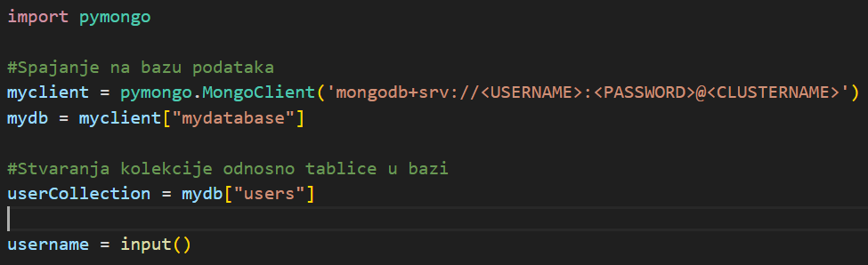
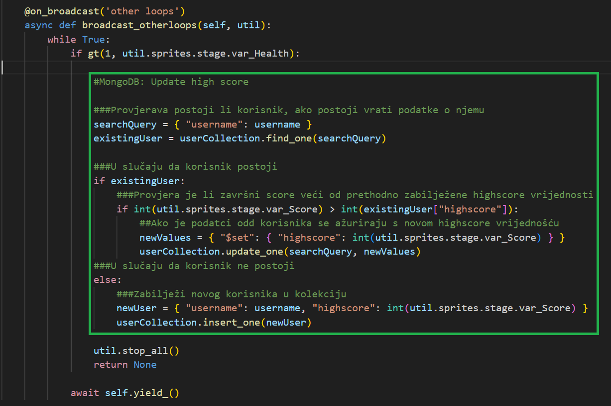
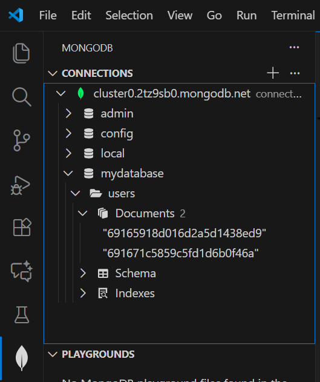
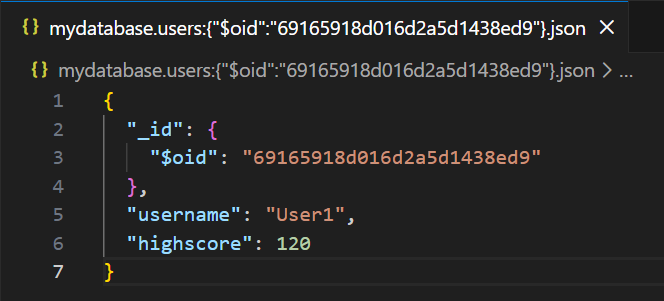
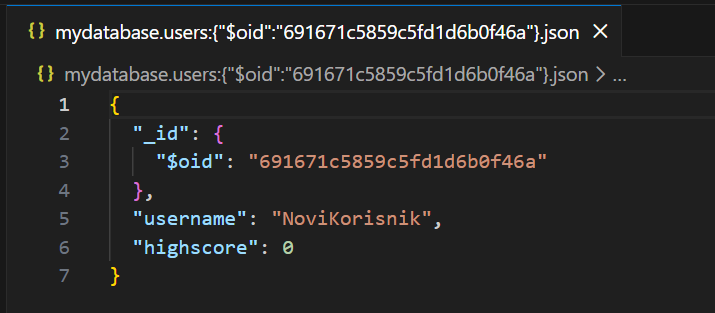

# Upute

> [!NOTE]
> Neki blokovi se ne mogu konvertirati (na primjer blokovi tipa `sensing_touchingcolor`), pa misli na moguću alternativu blokova koje koristiš (recimo umisto `sensing_touchingcolor` koristi `sensing_touchingsprite`)(zapravo nisan provjeria jel nemože konvertat taj blok ili samo nije mogu konvertat boju specifično ???&#129335;&#x1F937;)

## Potrebno okruženje

1. [Python 3](https://www.python.org/downloads/)
    - __[Posljednja stabilna verzija](https://www.python.org/downloads/release/python-3139/)__
    - [Posljednja verzija](https://www.python.org/downloads/release/python-3140/)

2. Code editor ili IDE
    - [VS Code](https://code.visualstudio.com/)

3. VS Code Python ekstenzija
    - [Python extension for Visual Studio Code](https://marketplace.visualstudio.com/items?itemName=ms-python.python)
    - __Na lijevoj programskoj traci odaberi tab _Extensions_ i potraži ekstenziju _Python_ od izdavača _Microsoft_.__

[Dodatno](https://code.visualstudio.com/docs/python/python-tutorial)

## Konverzija

1. Preuzmi Scratch projekt
    - Scratch programska traka > File > Save to your computer

2. [Preuzmi kkkonverter](https://github.com/BirdLogics/sb3topy/)
    - Zeleni code botun > Download ZIP

3. Konvertiraj projekt
    1. Unzip konverter > Otvori src mapu > Pokreni `run_gui.pyw` datoteku
    2. Odaberi scratch projekt odnosno `.sb3` datoteku za input project i napravi mapu za output project

Kod je poprilično razumljiv pa ako ti bude tribala provjera nekih podataka možeš samo na određene događaje dodavat printove, tribalo bi bit poprilično lagano.

> [!WARNING]
> U slučaju da se projekt ne pokreće i izbacuje greške s `path` problemima otvori direktno, samo datoteku projekta i onda će se projekt pokretat bez problema

## Postavljanje baze podataka

Najjednostavniji za korištenje je MongoDB

1. [Napravi račun](https://www.mongodb.com/)

2. Preuzmi VS Code MongoDB ekstenziju
    - [MongoDB for VS Code](https://marketplace.visualstudio.com/items?itemName=mongodb.mongodb-vscode)
    - __Na lijevoj programskoj traci odaberi tab _Extensions_ i potraži ekstenziju _MongoDB for VS Code_ od izdavača _MongoDB_.__

3. Napravi project / cluster na [sučelju MongoDB](https://cloud.mongodb.com/)
    - Kopiraj connection string oblika : `mongodb+srv://<USERNAME>:<PASSWORD>@<CLUSTERNAME>/`

4. Spoji ekstenziju na projekt
    1. Na lijevoj programskoj traci pronađi ekstenziju _MongoDB_
    2. Add Connextion > Connect with Connection String > Paste connection string

5. Omogući korištenje Python koda za MongoDB pomoću pymongo biblioteke
    - Uđi u CMD ili neki drugi terminal i pokreći naredbe
    1. `cd C:/Users/UserName/AppData/Local/Programs/Python/Python313/Scripts`
        - `Python313` može biti i neka druga vrijednost ovisno o kojoj verziji pythona govorimo
    2. `py -m ensurepip --upgrade`
    3. `python -m pip install pymongo`

## Korištenje baze podataka

Pogledaj some fuckass tutorijal ili pročitaj [materijale](https://www.w3schools.com/python/python_mongodb_getstarted.asp) (stvarno je jednostavno)

- Primjer
    - project.py > Line 8
        - 
    - project.py > Line 146
        - 
- Provjera stanja podataka u bazi
    - 
    - 
    - 
